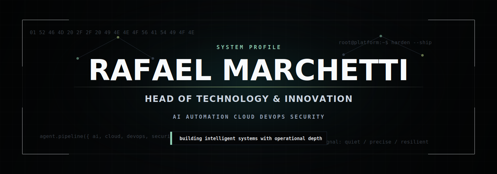

  

  

 

 

## 🧠 about-me.sh

<table border="0" cellspacing="0" cellpadding="14">
<tr>
<td width="50%" valign="top">

**`$ what_i_do`**

Lidero iniciativas de tecnologia e inovação utilizando **Inteligência Artificial**, **Automação**, desenvolvimento web e integrações de sistemas.

Atuo como **Head of Technology & Innovation**, desenvolvendo soluções baseadas em IA, APIs, WordPress, Docker e automações para otimizar processos e acelerar a transformação digital.

Atualmente sou **pós-graduando em DevOps & Cloud Platform Engineering com Inteligência Artificial pela PUC Minas**, aprofundando meus conhecimentos em arquitetura de plataformas, computação em nuvem, DevOps e cibersegurança.

</td>
<td width="50%" valign="top">

**`$ currently_exploring`**

- 🤖 Agentes de IA e Large Language Models (LLMs)
- 🔗 Model Context Protocol (MCP)
- 🎓 Pós-graduando em DevOps & Cloud Platform Engineering com IA
- 🐳 Docker e Conteinerização
- 🌱 Estudando Kubernetes
- 🛡️ Estudando Cyber Security
- 🌍 Entusiasta de Open Source

</td>
</tr>
</table>

 

| 🎓 Education | Institution |
|:---|:---|
| Bachelor's Degree in Computer Science | **PUC Minas** |
| Postgraduate Student — DevOps & Cloud Platform Engineering with Artificial Intelligence | **PUC Minas** |

 

 

## ⚙️ tech-stack.json

**🤖 Artificial Intelligence & Automation**

`OpenAI API` · `n8n` · `MCP` · `AI Agents`

  

**🧩 Backend**

  

**🎨 Frontend**

  

**☁️ Cloud & Deployment**

  

**🔧 DevOps & Infrastructure**

  

**🗄️ Databases**

  

**🛡️ Security & Tools**

`Cyber Security`

  

**🖥️ Operating Systems**

 

 

## 📊 github-analytics.exe

 

 

**`$ contribution_activity --graph`**

 

**`$ trophy_room --list`**

⏳ hospedado em serverless (Vercel) — se aparecer em branco na primeira visita, recarregue a página em alguns segundos.

 

**`$ ./contribution-snake --run`**

Gerado automaticamente via GitHub Actions — configuração completa no <code>INSTALL.md</code>.

 

 

## 🗺️ roadmap-2026.yml

| Status | Goal |
|:---:|:---|
| ✅ | GitHub Student Developer Pack |
| 🔄 | AWS Certification |
| 🔄 | Microsoft Azure Certification |
| 🔄 | Kubernetes (CKA) |
| 🔄 | AI Agents — advanced orchestration |
| 🔄 | Model Context Protocol (MCP) — deep dive |
| 🔄 | Cyber Security fundamentals & certifications |
| 🔄 | Local LLMs — self-hosted inference |
| 🔄 | Open Source Projects — meaningful contributions |

 

 

## 💼 featured-projects/

<table border="0" cellspacing="0" cellpadding="14">
<tr>
<td width="33%" valign="top">

### 🤖 AI Automation Hub

Orchestration platform connecting AI agents to business workflows through MCP and custom automation pipelines.

`Python` `n8n` `MCP` `Docker`

**[→ Code](https://github.com/rafamarchetti)** &nbsp;·&nbsp; **[↗ Live Demo](https://www.rafaelmarchetti.com.br)**

</td>
<td width="33%" valign="top">

### ☁️ Cloud Infra Toolkit

Infrastructure-as-Code toolkit for provisioning secure, scalable environments across AWS, Cloudflare and Vercel.

`Terraform` `AWS` `Cloudflare` `Docker`

**[→ Code](https://github.com/rafamarchetti)** &nbsp;·&nbsp; **[↗ Live Demo](https://www.rafaelmarchetti.com.br)**

</td>
<td width="33%" valign="top">

### 🛡️ SecureOps Dashboard

Monitoring and hardening dashboard for DevOps pipelines, combining CI/CD security checks with real-time alerts.

`PHP` `GitHub Actions` `Supabase` `Linux`

**[→ Code](https://github.com/rafamarchetti)** &nbsp;·&nbsp; **[↗ Live Demo](https://www.rafaelmarchetti.com.br)**

</td>
</tr>
</table>

📌 Substitua estes exemplos pelos seus repositórios reais — veja o <code>INSTALL.md</code>.

 

 

## 🎓 certifications.md

| Status | Certification / Program | Provider |
|:---:|:---|:---|
| ✅ | Bachelor's Degree in Computer Science | PUC Minas |
| 🔄 | Postgraduate — DevOps & Cloud Platform Engineering with AI | PUC Minas |
| ⏳ | AWS Certified Solutions Architect | Amazon Web Services |
| ⏳ | Microsoft Certified: Azure Fundamentals | Microsoft |
| ⏳ | Certified Kubernetes Administrator (CKA) | CNCF |
| ⏳ | Cyber Security Certification | TBD |

✅ Completed &nbsp;•&nbsp; 🔄 In Progress &nbsp;•&nbsp; ⏳ Planned

 

 

## 🔗 connect.sh

  

⚠️ Confirme/atualize os links de LinkedIn, Instagram, Telegram e YouTube com seus handles reais.

 

 

